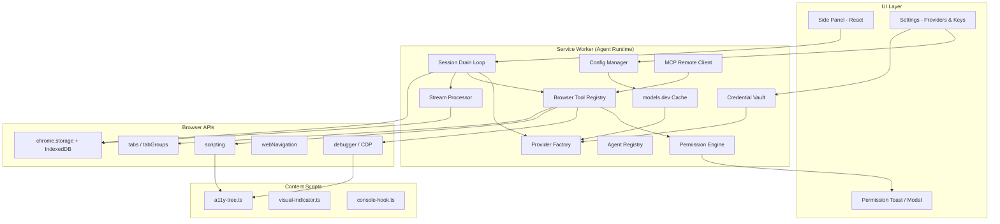

# Browser Agent Extension — Architecture Plan

A BYOK browser AI agent extension that can act on the web like a user: read tabs, navigate, click, type, extract data, and orchestrate multi-step tasks — with provider flexibility modeled after [OpenCode](https://github.com/sst/opencode) and browser automation patterns from [Hermes in Chrome](https://github.com/huaqing0/Hermes--in--chrome).

---

## 1. Goals

| Goal | Description |
|------|-------------|
| **BYOK** | Users bring their own API keys; credentials never leave the device unencrypted and are separate from synced config |
| **Any connectable provider** | 75+ providers via Vercel AI SDK + [models.dev](https://models.dev) catalog + OpenAI-compatible endpoints |
| **Actionable browser agent** | Tools for active tabs, navigation, DOM interaction, screenshots — not just chat-with-context |
| **Coding-agent ergonomics** | Permission rules (`allow` / `ask` / `deny`), agent modes, doom-loop detection, session persistence |
| **Open-source first** | Reuse OpenCode patterns, AI SDK, MCP SDK, Hermes browser-tool design — minimal bespoke infrastructure |

## 2. Non-Goals (v1)

- Replacing a full local agent runtime (Hermes Agent, OpenCode CLI) — the extension is self-contained
- stdio MCP servers (no Node child processes in MV3 service worker)
- Native Messaging / local file writes (optional phase 2)
- Bypassing site anti-bot systems
- Cloud-hosted agent backend (optional future connector)

---

## 3. Reference Analysis

### 3.1 OpenCode (provider + agent layer)

OpenCode (`sst/opencode`) is the blueprint for **everything except browser I/O**:

```
Config layers → models.dev catalog → Provider registry → AI SDK LanguageModel
                                                      ↓
Agent definition (mode, permission, model, steps) → Session Drain loop
                                                      ↓
Tool registry → permission.ask() → execute → stream processor → SQLite
```

**Patterns to adopt directly:**

| Pattern | OpenCode source | Our adaptation |
|---------|-----------------|----------------|
| models.dev catalog | `packages/core/src/models-dev.ts` | Fetch + cache in extension; 5min TTL |
| Provider factory map | `packages/opencode/src/provider/provider.ts` | Pre-bundle `@ai-sdk/*` in extension build |
| Custom OpenAI-compatible | `@ai-sdk/openai-compatible` | User-defined `baseURL` + `apiKey` in config |
| Permission ruleset | `packages/opencode/src/permission/index.ts` | Map `read`→`page_read`, `edit`→`click`/`type`, add `navigate`, `tab_*` |
| Agent modes | `packages/opencode/src/agent/agent.ts` | `browse` (read-only), `act` (full tools), `explore` (fast DOM scan) |
| Tool → AI SDK bridge | `packages/opencode/src/session/tools.ts` | Same `tool()` wrapper with Zod schemas |
| Session loop | `packages/opencode/src/session/prompt.ts` | `runLoop` until no pending tool calls |
| Doom-loop detection | `packages/opencode/src/session/processor.ts` | 3 identical tool calls → permission ask |
| MCP remote | `packages/opencode/src/mcp/index.ts` | HTTP/SSE only (ideal for extension) |
| Config layering | `packages/opencode/src/config/config.ts` | `chrome.storage.sync` + per-origin overrides |
| BYOK separation | `packages/opencode/src/auth/index.ts` | Keys in `chrome.storage.local` encrypted, never in sync storage |

**Patterns to simplify:**

- Drop Effect/Layer DI — use plain TypeScript modules (extension bundle size + MV3 constraints)
- Drop dynamic npm provider install — pre-bundle top 10 providers; rest via `@ai-sdk/openai-compatible`
- Drop SQLite/Drizzle — use IndexedDB via `idb` or Dexie
- Drop PTY/bash/LSP/filesystem tools — replace with browser-native tools

### 3.2 Hermes in Chrome (browser tool layer)

Hermes demonstrates production-grade **in-extension browser automation**:

```
Side Panel UI ←→ Service Worker ←→ [optional] Hermes backend
                      │
                      ├─ chrome.debugger (CDP: click, type, screenshot)
                      ├─ chrome.scripting (inject a11y-tree content script)
                      ├─ chrome.tabs / tabGroups (multi-tab sessions)
                      └─ content scripts (a11y tree, console hook, visual indicator)
```

**Patterns to adopt:**

| Pattern | Hermes source | Notes |
|---------|---------------|-------|
| A11y tree as page model | `src/content/a11y-tree.ts` | Structured refs instead of raw HTML; survives MV3 isolation |
| CDP via debugger API | `src/background/debugger.ts` | Real clicks, paste, screenshots — required for "act like user" |
| Per-session tab binding | `src/background/tools.ts` | `sessionId → currentTabId` map |
| Execution modes | sidepanel i18n | `plan` (read-only), `approval` (ask per write), `auto` |
| Tab groups | `src/background/tabGroup.ts` | Isolate agent-opened tabs |
| Threat model | `docs/threat-model.md` | Prompt injection, clipboard, broad permissions |
| Rich-text type safety | tools.ts clipboard snapshot/restore | Prevent draft residue on X/YouTube etc. |

**What we do differently:**

- **Self-contained agent loop** in the extension (no required Python backend)
- **OpenCode-style provider config** instead of Hermes-only backend env vars
- Frontend BYOK with encrypted local storage (Hermes recommends backend keys)

### 3.3 Other references

| Project | Reuse |
|---------|-------|
| [abundantbeing/hermes-browser-extension](https://github.com/abundantbeing/hermes-browser-extension) | Side panel UX, context collector, remote API client pattern |
| [browserbase/stagehand](https://github.com/browserbase/stagehand) | Tool design inspiration (`act`/`extract`/`observe`) — **not** the SDK (needs Playwright) |
| Chrome Side Panel API | Primary UI surface; no host permissions needed for panel itself |

---

## 4. Proposed Architecture



### 4.1 Process model (Manifest V3)

| Context | Role | Lifetime |
|---------|------|----------|
| **Side Panel** | Chat UI, settings, permission prompts, streaming display | Per window, persistent while open |
| **Service Worker** | Agent loop, tool dispatch, provider calls, session state | Event-driven; must persist state externally |
| **Content Scripts** | A11y tree generation, DOM observation, visual feedback | Per tab/frame |
| **Offscreen Document** | Clipboard ops, audio (optional) | Created on demand |

**Critical MV3 constraint:** Service workers are ephemeral. All session state, pending permissions, and in-flight tool results must live in IndexedDB + `chrome.storage`. Use `chrome.alarms` to keep long-running agent loops alive during multi-step tasks.

---

## 5. Monorepo Structure

```
browser-agent/
├── packages/
│   ├── extension/          # MV3 extension (Vite + CRXJS)
│   │   ├── src/
│   │   │   ├── background/     # service worker: loop, tools, providers
│   │   │   ├── sidepanel/      # React UI
│   │   │   ├── content/        # a11y-tree, indicators
│   │   │   ├── offscreen/      # clipboard helper
│   │   │   └── manifest.json
│   │   └── vite.config.ts
│   ├── core/               # Shared logic (portable from OpenCode patterns)
│   │   ├── provider/       # models.dev, factory, transforms
│   │   ├── agent/          # agent defs, permission merge
│   │   ├── permission/     # ruleset eval (allow/ask/deny)
│   │   ├── session/        # drain loop, processor, compaction
│   │   ├── tools/          # tool registry interface + browser impl
│   │   ├── mcp/            # remote MCP client
│   │   └── config/         # schema, merge, validation
│   └── ui/                 # Shared React components (optional)
├── docs/
│   ├── ARCHITECTURE.md     # this file
│   ├── PERMISSIONS.md
│   ├── TOOLS.md
│   └── THREAT-MODEL.md
├── package.json            # pnpm workspaces
└── turbo.json
```

---

## 6. Provider & BYOK System

### 6.1 Provider resolution (OpenCode-compatible)

```typescript
// Resolution order (same as OpenCode):
// 1. models.dev catalog (bundled snapshot + network cache)
// 2. User config provider overrides (opencode.json-compatible schema)
// 3. Env-style autoload from stored credentials
// 4. Custom loaders per provider (anthropic headers, bedrock region, etc.)

interface ProviderConfig {
  npm?: string;           // "@ai-sdk/anthropic" | "@ai-sdk/openai-compatible"
  name?: string;
  api?: string;           // base URL for compatible providers
  options?: {
    apiKey?: string;      // prefer vault over inline
    headers?: Record<string, string>;
  };
  models?: Record<string, { name: string; tool_call?: boolean }>;
}
```

### 6.2 Bundled providers (extension build)

Pre-bundle to avoid runtime npm installs:

| Package | Providers |
|---------|-----------|
| `@ai-sdk/anthropic` | Claude |
| `@ai-sdk/openai` | GPT, o-series |
| `@ai-sdk/google` | Gemini |
| `@ai-sdk/amazon-bedrock` | Bedrock |
| `@ai-sdk/azure` | Azure OpenAI |
| `@openrouter/ai-sdk-provider` | OpenRouter (100+ models) |
| `@ai-sdk/openai-compatible` | Ollama, LM Studio, vLLM, any OpenAI API |
| `@ai-sdk/groq` | Groq |
| `@ai-sdk/mistral` | Mistral |
| `@ai-sdk/xai` | Grok |

### 6.3 BYOK credential vault

```
chrome.storage.sync  →  config (providers, agents, permissions) — NO keys
chrome.storage.local →  encrypted credential vault
IndexedDB            →  sessions, messages, tool results
```

**Encryption:** Use Web Crypto API (`AES-GCM`) with a key derived from a user passphrase OR OS-level wrapping via `chrome.identity` (future). Minimum v1: `chrome.storage.local` with extension-isolated encryption key generated on first run.

**Config file compatibility:** Support `browser-agent.json` with the same schema subset as OpenCode's `provider` and `agent` blocks so users can share configs.

### 6.4 Model selection UX

- Fetch models.dev on startup → populate model picker grouped by provider
- Show capabilities: tool_call, vision, context window, reasoning
- Per-agent default model override (like OpenCode `build` vs `explore` agents)
- `small_model` equivalent for title generation / compaction

---

## 7. Agent System

### 7.1 Built-in agents

| Agent | Mode | Default permissions | Use case |
|-------|------|---------------------|----------|
| `browse` | primary | `page_read: allow`, `click/type/navigate: deny` | Research, summarize, extract |
| `act` | primary | `*: ask` on sensitive domains, `*: allow` elsewhere | Full browser automation |
| `explore` | subagent | `page_read/grep_page: allow`, all writes: deny | Fast multi-tab reconnaissance |
| `compact` | hidden | internal | Context compaction |
| `title` | hidden | internal | Session title generation |

### 7.2 Session drain loop

Port OpenCode's `runLoop` semantics:

```
while (session has work):
  1. Check context overflow → auto-compact if needed
  2. Resolve agent + model for this turn
  3. Build tool set (filtered by agent permission + model capabilities)
  4. streamText({ model, tools, messages })
  5. Process stream events:
     - text-delta → append to assistant message
     - tool-call → permission check → execute → tool-result
     - reasoning → append (if supported)
  6. If tool calls pending → continue loop
  7. If doom loop detected (3 identical calls) → ask user
  8. If step limit reached → inject MAX_STEPS prompt
```

### 7.3 System context (browser-specific)

Inject structured context each turn (OpenCode "System Context" pattern):

```json
{
  "active_tab": { "id": 42, "url": "...", "title": "..." },
  "open_tabs": [{ "id": 42, "url": "...", "title": "..." }],
  "agent_mode": "act",
  "permission_profile": "default",
  "viewport": { "width": 1440, "height": 900 }
}
```

---

## 8. Browser Tool Registry

### 8.1 Core tools (v1)

| Tool | Permission key | Description |
|------|----------------|-------------|
| `tabs_list` | `tabs` | List open tabs with id, url, title, active |
| `tabs_focus` | `tab_focus` | Switch active tab |
| `tabs_open` | `tab_open` | Open URL in new tab (optionally in agent tab group) |
| `tabs_close` | `tab_close` | Close tab (ask on non-agent tabs) |
| `page_read` | `page_read` | A11y tree + optional text extraction |
| `page_screenshot` | `screenshot` | Viewport or element screenshot (vision models) |
| `page_grep` | `grep_page` | Search visible text / a11y labels |
| `navigate` | `navigate` | Go to URL in session tab |
| `click` | `click` | CDP click by ref_id or coordinates |
| `type` | `type` | CDP type with clipboard safety |
| `scroll` | `scroll` | Scroll viewport or element |
| `hover` | `hover` | Hover for tooltips/menus |
| `select` | `select` | Select dropdown option |
| `wait` | `wait` | Wait for navigation/selector/timeout |
| `evaluate` | `evaluate` | Run bounded JS in page (ask always) |
| `web_fetch` | `webfetch` | Fetch URL (CORS-bypass via SW) |
| `network_log` | `network` | Recent requests from tab (CDP) |
| `console_log` | `console` | Recent console output |
| `task` | `task` | Spawn subagent session |

### 8.2 Page model (a11y tree)

Adopt Hermes' ref-based model — the LLM interacts with `ref_id` strings, not CSS selectors:

```
Page content (viewport 1440x900):
  [ref_1] button "Sign in" (clickable)
  [ref_2] textbox "Email" placeholder="you@example.com" (editable)
  [ref_3] link "Forgot password?" (clickable)
```

Benefits: resilient to DOM changes, works across frames, compact context.

### 8.3 CDP vs scripting

| Operation | API | Why |
|-----------|-----|-----|
| Read DOM structure | `scripting.executeScript` + a11y-tree | No debugger banner |
| Click, type, screenshot | `chrome.debugger` (CDP) | Real user-like input; handles rich text |
| Navigate | `chrome.tabs.update` | Simple, reliable |
| Network inspection | CDP `Network.*` events | Full request metadata |

**UX:** Show visual indicator on agent-controlled tabs (Hermes `visual-indicator.ts`). Display Chrome's debugger banner is unavoidable for CDP — document this clearly.

### 8.4 Tool output truncation

Port OpenCode's `Truncate` service — browser pages can be huge:

- A11y tree: max 50KB per read; paginate with `offset` param
- Screenshots: resize + JPEG compress before sending to model
- Network logs: last N entries, headers optional

---

## 9. Permission System

### 9.1 Rules (OpenCode-compatible)

```json
{
  "permission": {
    "*": "allow",
    "click": "ask",
    "type": "ask",
    "navigate": "ask",
    "evaluate": "deny",
    "screenshot": "ask",
    "tab_close": "ask",
    "webfetch": "ask"
  }
}
```

### 9.2 Site-level patterns

Extend OpenCode's wildcard patterns to URLs:

```json
{
  "permission": {
  "click": {
    "*": "ask",
    "https://mail.google.com/*": "deny",
    "https://github.com/*": "allow"
  },
  "navigate": {
    "*": "ask",
    "https://*.google.com/*": "allow"
  }
}
}
```

### 9.3 Execution modes (user-facing)

| Mode | Behavior | Maps to |
|------|----------|---------|
| **Plan** | Read-only tools only | Agent `browse` + write tools denied |
| **Approval** | Ask before every write/navigate | Default permission = `ask` |
| **Auto** | Allow unless denied by rules | Default permission = `allow` |

### 9.4 Permission ask flow

```
Tool call → evaluate(agent.rules, session.rules, approved.rules, url_pattern)
  → allow: execute immediately
  → deny: return error to model
  → ask: emit PermissionAsked event → side panel modal
       → user: Once | Always | Reject
       → Always: add rule to session.approved
```

### 9.5 Sensitive domain defaults

Ship a built-in denylist for high-risk patterns (user-overridable):

- `*://*/login*`, `*://*/checkout*`, `*://*/payment*`
- Banking, crypto wallet, password manager URLs
- `chrome://*`, `chrome-extension://*`

---

## 10. Data Persistence

### 10.1 Storage map

| Data | Store | Schema |
|------|-------|--------|
| User config | `chrome.storage.sync` | `browser-agent.json` subset |
| API keys / OAuth tokens | `chrome.storage.local` (encrypted) | `{ providerId: { type, key, expires } }` |
| Sessions | IndexedDB `sessions` | id, title, agent, model, created, updated |
| Messages | IndexedDB `messages` | sessionId, role, parts[] |
| Parts | IndexedDB `parts` | messageId, type (text/tool/reasoning), content |
| Permission approvals | IndexedDB `permissions` | sessionId, rules[] |
| models.dev cache | `chrome.storage.local` | JSON blob + timestamp |
| Tool output files | IndexedDB blobs | Large screenshots, page dumps |

### 10.2 Session lifecycle

- Auto-save after every stream event (OpenCode incremental persistence)
- Session list in side panel with search
- Export/import sessions as JSON
- Configurable retention (30/90/unlimited days)

### 10.3 Compaction

When context approaches model limit:

1. Summarize older messages with `small_model` or same model
2. Preserve tool results as condensed summaries
3. Start new "context epoch" (OpenCode terminology)

---

## 11. MCP Integration

Extension can only use **remote** MCP transports:

| Transport | Support | Use case |
|-----------|---------|----------|
| HTTP (Streamable) | Yes | Remote MCP servers |
| SSE | Yes | Legacy MCP servers |
| stdio | No | Requires child process |

Tool naming: `{server}_{tool}` (OpenCode convention).

Optional v1 MCP tools: `list_mcp_resources`, `read_mcp_resource`.

OAuth for MCP: local callback via side panel redirect (same pattern as OpenCode `oauth-provider.ts`).

---

## 12. Security & Threat Model

### 12.1 Assets at risk

- Page content, screenshots, URLs, form data
- API keys in local storage
- Clipboard during type operations
- User's authenticated sessions in browser cookies (agent acts as user)

### 12.2 Threats

| Threat | Mitigation |
|--------|------------|
| Prompt injection via page content | System prompt hardening; separate user vs page context; warn in UI |
| Agent clicks wrong button | Approval mode; ref confirmation for destructive actions |
| API key exfiltration | Keys only in encrypted local storage; never in content scripts; CSP strict |
| Over-privileged extension | Optional permissions where possible; document tradeoffs |
| Doom loops | 3x identical tool call detection |
| Data sent to LLM provider | BYOK = user's provider; show data flow diagram in settings |

### 12.3 Manifest permissions (progressive)

**Required (core):**
- `sidePanel`, `storage`, `activeTab`, `scripting`, `tabs`, `alarms`

**Optional (granted on first agent action):**
- `debugger` — required for click/type/screenshot
- `clipboardRead`/`clipboardWrite` — for rich text input
- `tabGroups` — for tab isolation
- `webNavigation` — for navigation events
- `notifications` — permission ask when side panel closed

**Host permissions:**
- `https://*/*` — only when user enables "act on all sites"
- Alternative: activeTab-only mode (current tab, no broad host access)

---

## 13. Tech Stack

| Layer | Choice | Rationale |
|-------|--------|-----------|
| Build | Vite + CRXJS | Fast HMR, MV3 support |
| UI | React 19 + Tailwind | Side panel; matches Hermes |
| Language | TypeScript 5.x | Type safety across packages |
| LLM | Vercel AI SDK v6 | Same as OpenCode; streaming + tools |
| Validation | Zod 4 | Tool schemas, config |
| Storage | idb (IndexedDB) + chrome.storage | MV3-compatible |
| MCP | `@modelcontextprotocol/sdk` | Remote transports |
| Testing | Vitest + Playwright | Unit + optional e2e |
| Monorepo | pnpm + Turborepo | Match OpenCode |

---

## 14. Implementation Phases

### Phase 0 — Scaffold
- [ ] Monorepo setup (pnpm, turbo, packages)
- [ ] MV3 extension shell with side panel
- [ ] Service worker message routing
- [ ] Config schema + storage layer

### Phase 1 — Provider & BYOK
- [ ] models.dev fetch/cache
- [ ] Provider factory (5 bundled providers + openai-compatible)
- [ ] Encrypted credential vault
- [ ] Settings UI: provider picker, key entry, model test
- [ ] Basic chat (no tools) with streaming

### Phase 2 — Agent Loop
- [ ] Session store (IndexedDB)
- [ ] Session drain loop with AI SDK `streamText`
- [ ] Stream processor (text, tool-call, tool-result)
- [ ] Agent definitions (browse, act)
- [ ] Permission engine (allow/ask/deny)

### Phase 3 — Browser Tools (Read)
- [ ] Content script: a11y-tree generator
- [ ] `tabs_list`, `tabs_focus`, `page_read`, `page_grep`
- [ ] `navigate`, `page_screenshot` (CDP)
- [ ] Tool output truncation

### Phase 4 — Browser Tools (Act)
- [ ] CDP debugger integration
- [ ] `click`, `type`, `scroll`, `hover`, `select`
- [ ] Clipboard safety for rich text
- [ ] Visual indicator on agent tabs
- [ ] Tab groups for session isolation

### Phase 5 — Permissions & Safety
- [ ] Permission ask UI (Once / Always / Reject)
- [ ] Execution modes (plan / approval / auto)
- [ ] Site-level permission rules
- [ ] Doom-loop detection
- [ ] Sensitive domain defaults

### Phase 6 — Polish
- [ ] MCP remote client
- [ ] Session compaction
- [ ] Export/import
- [ ] Keyboard shortcuts
- [ ] Threat model doc + onboarding

### Phase 7 — Optional
- [ ] Native messaging host (local file save)
- [ ] Remote backend connector (Hermes/OpenCode compat)
- [ ] Firefox port (WebExtensions)
- [ ] `chrome.identity` OAuth for providers

---

## 15. Key Dependencies

```json
{
  "dependencies": {
    "ai": "^6.0.0",
    "@ai-sdk/anthropic": "^3.0.0",
    "@ai-sdk/openai": "^3.0.0",
    "@ai-sdk/google": "^3.0.0",
    "@ai-sdk/openai-compatible": "^2.0.0",
    "@openrouter/ai-sdk-provider": "^2.0.0",
    "@modelcontextprotocol/sdk": "^1.29.0",
    "zod": "^4.0.0",
    "idb": "^8.0.0",
    "remeda": "^2.0.0"
  },
  "devDependencies": {
    "vite": "^7.0.0",
    "@crxjs/vite-plugin": "^2.0.0",
    "vitest": "^4.0.0",
    "typescript": "^5.9.0"
  }
}
```

---

## 16. Open Questions

| Question | Options | Recommendation |
|----------|---------|----------------|
| Agent loop in SW vs offscreen doc? | SW only / offscreen / both | SW with `chrome.alarms` keepalive; offscreen for clipboard only |
| Required backend? | None / optional / required | None required; optional connector for power users |
| Vision handling? | Same model / auxiliary model | Auto-detect; fallback to screenshot + text model |
| Firefox support? | Chrome-first / dual | Chrome-first; design for WebExtensions compat |
| Config format? | Custom / OpenCode-compat | OpenCode-compat subset for provider + agent blocks |

---

## 17. Success Criteria

1. User can add an Anthropic/OpenAI/OpenRouter/Ollama key and chat within 60 seconds of install
2. Agent can read the active tab's content and answer questions about it
3. Agent can navigate, click, and type on a test page (e.g., form fill demo)
4. Permission prompts appear before destructive actions in approval mode
5. Sessions persist across browser restarts
6. No credentials in synced storage or content scripts
