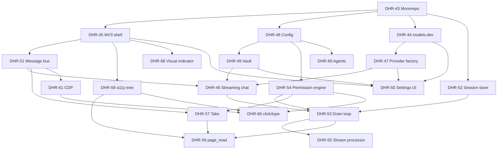

# Linear Project Sync

**Project:** [Browser Agent Extension](https://linear.app/dhruvsprojects/project/browser-agent-extension-d4eb96c4fb46)  
**Dependency doc:** [Dependency Graph & Parallel Tracks](https://linear.app/dhruvsprojects/document/dependency-graph-and-parallel-tracks-ecc2eb16861c)

## Sprints (milestones)

| Sprint | Milestone | Target |
|--------|-----------|--------|
| 0 | Scaffold | 2026-07-21 |
| 1 | Provider & BYOK | 2026-07-28 |
| 2 | Agent Loop | 2026-08-04 |
| 3 | Browser Read Tools | 2026-08-11 |
| 4 | Browser Act Tools | 2026-08-18 |
| 5 | Permissions & Safety | 2026-08-25 |
| 6 | Polish | 2026-09-01 |

## Issue index

### Sprint 0 — Scaffold
| ID | Title | Blocks |
|----|-------|--------|
| [DHR-43](https://linear.app/dhruvsprojects/issue/DHR-43) | Monorepo scaffold | 45, 48, 44, 52 |
| [DHR-45](https://linear.app/dhruvsprojects/issue/DHR-45) | MV3 shell + side panel | 51, 58, 68, 50, 62 |
| [DHR-51](https://linear.app/dhruvsprojects/issue/DHR-51) | Service worker message bus | 46, 57, 61 |
| [DHR-48](https://linear.app/dhruvsprojects/issue/DHR-48) | Config schema + storage | 49, 54, 60 |

### Sprint 1 — Provider & BYOK
| ID | Title | Blocked by |
|----|-------|------------|
| [DHR-44](https://linear.app/dhruvsprojects/issue/DHR-44) | models.dev catalog | 43 |
| [DHR-47](https://linear.app/dhruvsprojects/issue/DHR-47) | Provider factory | 44 |
| [DHR-49](https://linear.app/dhruvsprojects/issue/DHR-49) | Credential vault | 48 |
| [DHR-50](https://linear.app/dhruvsprojects/issue/DHR-50) | Settings UI | 45, 44, 47, 49 |
| [DHR-46](https://linear.app/dhruvsprojects/issue/DHR-46) | Streaming chat | 51, 47, 49 |

### Sprint 2 — Agent Loop
| ID | Title | Blocked by |
|----|-------|------------|
| [DHR-52](https://linear.app/dhruvsprojects/issue/DHR-52) | IndexedDB session store | 43 |
| [DHR-53](https://linear.app/dhruvsprojects/issue/DHR-53) | Session drain loop | 46, 52, 54 |
| [DHR-55](https://linear.app/dhruvsprojects/issue/DHR-55) | Stream processor | 53 |
| [DHR-60](https://linear.app/dhruvsprojects/issue/DHR-60) | Agent definitions | 48 |
| [DHR-54](https://linear.app/dhruvsprojects/issue/DHR-54) | Permission engine | 48 |

### Sprint 3 — Browser Read
| ID | Title | Blocked by |
|----|-------|------------|
| [DHR-58](https://linear.app/dhruvsprojects/issue/DHR-58) | a11y-tree | 45 |
| [DHR-57](https://linear.app/dhruvsprojects/issue/DHR-57) | Tabs tools | 51, 54 |
| [DHR-56](https://linear.app/dhruvsprojects/issue/DHR-56) | page_read + grep | 58, 57, 53 |
| [DHR-59](https://linear.app/dhruvsprojects/issue/DHR-59) | navigate + screenshot | 57, 61 |

### Sprint 4 — Browser Act
| ID | Title | Blocked by |
|----|-------|------------|
| [DHR-61](https://linear.app/dhruvsprojects/issue/DHR-61) | CDP debugger | 51 |
| [DHR-66](https://linear.app/dhruvsprojects/issue/DHR-66) | click/type/scroll/hover/select | 61, 58, 54 |
| [DHR-69](https://linear.app/dhruvsprojects/issue/DHR-69) | Clipboard safety | 66 |
| [DHR-68](https://linear.app/dhruvsprojects/issue/DHR-68) | Visual indicator | 45 |
| [DHR-65](https://linear.app/dhruvsprojects/issue/DHR-65) | Tab groups | 57 |

### Sprint 5 — Permissions
| ID | Title | Blocked by |
|----|-------|------------|
| [DHR-62](https://linear.app/dhruvsprojects/issue/DHR-62) | Permission ask UI | 54, 45 |
| [DHR-63](https://linear.app/dhruvsprojects/issue/DHR-63) | Execution modes | 60, 54, 62 |
| [DHR-64](https://linear.app/dhruvsprojects/issue/DHR-64) | Site-level rules | 54, 50 |
| [DHR-67](https://linear.app/dhruvsprojects/issue/DHR-67) | Doom-loop detection | 55, 62 |

### Sprint 6 — Polish
| ID | Title | Blocked by |
|----|-------|------------|
| [DHR-70](https://linear.app/dhruvsprojects/issue/DHR-70) | Remote MCP | 53, 48 |
| [DHR-74](https://linear.app/dhruvsprojects/issue/DHR-74) | Session compaction | 55, 52, 47 |
| [DHR-72](https://linear.app/dhruvsprojects/issue/DHR-72) | Export/import | 52 |
| [DHR-71](https://linear.app/dhruvsprojects/issue/DHR-71) | Keyboard shortcuts | 45, 53 |
| [DHR-73](https://linear.app/dhruvsprojects/issue/DHR-73) | Threat-model onboarding | 63, 50 |

## Dependency graph (mermaid)

## First parallel batch (NOW)

1. **In progress:** [DHR-43](https://linear.app/dhruvsprojects/issue/DHR-43) Monorepo scaffold
2. **Immediately after DHR-43 completes**, start in parallel:
   - **Track A:** DHR-45 MV3 shell (critical path)
   - **Track B:** DHR-48 Config schema
   - **Track C:** DHR-44 models.dev
   - **Track D:** DHR-52 IndexedDB session store

## Labels

| Label | Meaning |
|-------|---------|
| `scaffold` | Monorepo / MV3 shell |
| `provider` | BYOK / models.dev / AI SDK |
| `agent-runtime` | Loop, sessions, MCP |
| `browser-tools` | Tabs, a11y, CDP |
| `ui` | Side panel / settings |
| `security` | Vault, permissions |
| `parallel-ready` | Unblocked or only waiting on monorepo |
