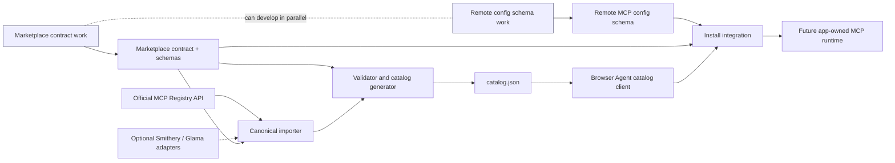

# Marketplace contract and catalog boundary

Status: implementation-ready scaffold. This repository contains contract, importer, validation, and
read-only discovery code. It intentionally contains no MCP transport/runtime and no install flow.

## Scope and invariants

Marketplace items are declarative JSON:

- `connector`: one hosted MCP server with a required HTTPS Streamable HTTP endpoint and optional
  legacy HTTPS SSE endpoint.
- `skill`: Markdown instructions plus explicit connector/tool requirements.
- `plugin`: references to one connector and one or more skills, with scalar values or vault-key
  references only.

The v1 schemas are in `packages/marketplace/schemas/v1`. Objects are closed with
`additionalProperties: false`; executable fields such as `javascript`, `entrypoint`, `command`,
`module`, and inline code are not part of the model and fail validation. The contract never accepts
stdio/package launch instructions. Credentials are metadata or vault-key references, never values.

## Proposed separate repository

The package has been kept self-contained so it can move without importing browser-agent:

```text
browser-agent-marketplace/
├── schemas/v1/
│   ├── common.schema.json
│   ├── connector.schema.json
│   ├── skill.schema.json
│   ├── plugin.schema.json
│   └── catalog.schema.json
├── src/
│   ├── schemas.ts
│   ├── catalog.ts
│   ├── cli.ts
│   └── providers/
│       ├── types.ts
│       └── mcp-registry.ts
├── examples/
├── moderation/
│   ├── policy.md
│   └── decisions/
└── catalog.json
```

Only the small `@browser-agent/core/marketplace` HTTP catalog interface remains app-owned. After
extraction, published contract artifacts should be consumed as a pinned package and schema URL.

## Publication workflow

1. Add or import manifests on a review branch. The official MCP Registry API
   (`https://registry.modelcontextprotocol.io/v0.1/servers`) is the canonical connector source.
   Smithery and Glama can be implemented through optional provider interfaces but are not required
   to build the catalog.
2. Run `pnpm --filter @browser-agent/marketplace-contract validate:examples` or
   `browser-agent-marketplace validate <directory>`.
3. Review provenance, endpoint ownership, requested credential headers, license, tool annotations,
   compatibility, and moderation status.
4. Generate deterministically ordered output with
   `browser-agent-marketplace generate <directory> <output>/catalog.json`.
5. In CI, validate all JSON Schemas, verify content checksums/signatures, create a signed provenance
   attestation, and publish immutable versioned artifacts. Promote a reviewed digest to the
   well-known `catalog.json`; never mutate an already published item version.
6. Browser Agent fetches the catalog as untrusted data and validates the selected full manifest
   again before presenting an install plan.

The generator's timestamp is injectable for reproducible tests. Catalog items sort by
`kind:id@version`; publication CI should set a fixed build timestamp when byte-for-byte
reproducibility is required.

## Validation and security model

- HTTPS is mandatory for remote transport, provenance, and signature URLs. URL templates from the
  upstream Registry are skipped because the app does not yet have a safe variable-resolution
  contract.
- JSON objects are strict and plugin configuration permits only scalar literals or named secret
  references. A secret reference is resolved by app-owned vault code only after user approval.
- Directory validation rejects malformed/duplicate items, missing bundle references, missing skill
  dependencies, traversal in instruction paths, symlinked skill content, and skill checksum
  mismatches.
- A catalog is data, not authority. Registry presence or a matching checksum does not imply safety.
  Tool annotations are publisher claims and must not bypass Browser Agent permissions.
- Installation must show endpoint, provenance, credentials, requested tools, and checksum. Runtime
  network access and tool calls remain subject to app permissions.
- Catalog clients apply response-size and cache controls at the hosting/integration layer. The
  scaffold does not execute, install, or connect to any item.

Checksums have typed semantics: skill digests cover the exact Markdown bytes; official Registry
connector digests cover canonicalized upstream `server` JSON. Before public publication, plugin and
manual connector checksums should cover canonical manifest payloads with the checksum/signature
fields omitted. That canonicalization rule must be frozen before accepting third-party signatures.

## Signature and provenance plan

V1 records source provider, source URL, source identity, import time, SHA-256, verification state,
and optional signature metadata. The recommended publication path is Sigstore keyless signing:

1. importer records the untouched upstream response as a build input and emits its digest;
2. CI produces an in-toto/SLSA provenance statement linking source revision, importer version,
   normalized manifests, skill bytes, and catalog digest;
3. CI signs manifests and catalog with workload identity and stores the Sigstore bundle/Rekor proof;
4. clients verify digest, signature identity, inclusion proof, and trusted publication policy;
5. revocations are append-only moderation records, never silent artifact replacement.

`verification.status: registry` means normalized from the official API, not cryptographically
endorsed by the Registry. `verified` is reserved for artifacts that pass the publication policy.

## Moderation

Initial submissions require human review. Reject or quarantine impersonation, unverifiable endpoint
ownership, credential harvesting, undisclosed data egress, malicious prompt instructions, license
conflicts, mutable download URLs, and misleading tool annotations. Reports should identify
item/version/digest and use an append-only decision record.

Actions are `allow`, `warn`, `quarantine`, and `revoke`. Revocation prevents new installs while
retaining metadata needed to warn existing users. Appeals require a new evidence-linked decision.
Automated scanning can prioritize review but cannot promote an item to `verified`.

## App consumption API

Discovery uses only `@browser-agent/core/marketplace`:

```ts
const client = new HttpMarketplaceCatalogClient(catalogUrl, fetch)
const catalog = await client.getCatalog({ signal })
```

The boundary validates the catalog envelope and item summaries, then retains each full declarative
document for later contract validation. It does not resolve secrets or instantiate MCP clients.
Hosting can expose immutable `/catalog/<digest>.json` plus a cacheable `/catalog.json` pointer.

Install integration must parse the selected document with the pinned marketplace contract, compare
compatibility, obtain user consent, and translate it to app configuration only after the remote MCP
configuration schema is finalized.

## Dependency graph



The contract, Registry normalization, moderation policy, and discovery client can develop in
parallel with the app's remote MCP configuration schema. Installation is the synchronization point:
it waits for both the contract and remote configuration schema. MCP runtime work is explicitly out
of scope here.
