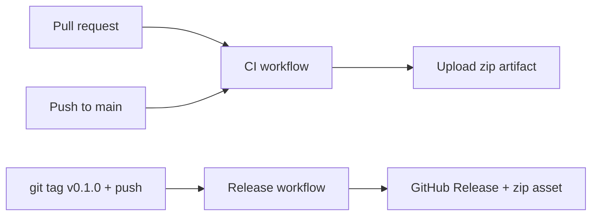

# Releases & CI

## How it works



| Workflow | File | Trigger | Output |
|----------|------|---------|--------|
| CI | `.github/workflows/ci.yml` | PR / push `main` | Checks + **Actions artifact** zip (14-day retention) |
| Release | `.github/workflows/release.yml` | Tag `v*` or manual dispatch | **GitHub Release** with downloadable zip + auto change notes |

## Publish a downloadable build

After merging to `main`:

```bash
git checkout main
git pull
git tag v0.1.0
git push origin v0.1.0
```

Or: GitHub → **Actions** → **Release** → **Run workflow** → enter `v0.1.0`.

The release body includes install steps; GitHub also appends auto-generated change notes from commits since the previous tag.

Artifact name: `browser-agent-extension-0.1.0.zip` (manifest version synced from the tag).

## Local pack (same zip)

```bash
pnpm --filter @browser-agent/extension build
pnpm pack:extension
# → release/browser-agent-extension-<version>.zip
```
